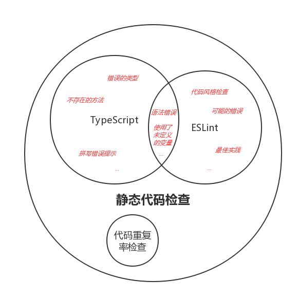

# TypeScript 与 ESLint（草稿）

[ESLint][] 是一个代码检查工具，主要用来发现代码错误、统一代码风格，目前已被广泛的应用于各种 JavaScript 项目中。

它通过插件化的特性极大的丰富了适用范围，搭配 [`typescript-eslint-parser`][] 之后，甚至可以用来检查 TypeScript 代码。

## 为什么需要 ESLint

TypeScript 已经可以对代码进行静态检查了，那么为什么还需要 ESLint 呢？

其实 ESLint




下面我们来一步一步给我们的 TypeScript 项目添加 ESLint 检查。

## 安装

首先，我们需要安装 ESLint 和一些插件：

```bash
npm install -g eslint
```

关于 TypeScript 与 ESLint，有过一些争论：

- 使用 ESLint 加上

运行 eslint 时报错 Cannot find module 'typescript-eslint-parser'

你运行的是全局的 eslint，需要运行 `./node_modules/.bin/eslint xxx.ts'

不支持某些 规则，比如 no-undef

有冲突的规则，比如 spaced-comment


cannot read property type of null

react 规则不可用


react/sort-comp type-annotations

[ESLint]: https://eslint.org/
[`typescript-eslint-parser`]: https://github.com/eslint/typescript-eslint-parser