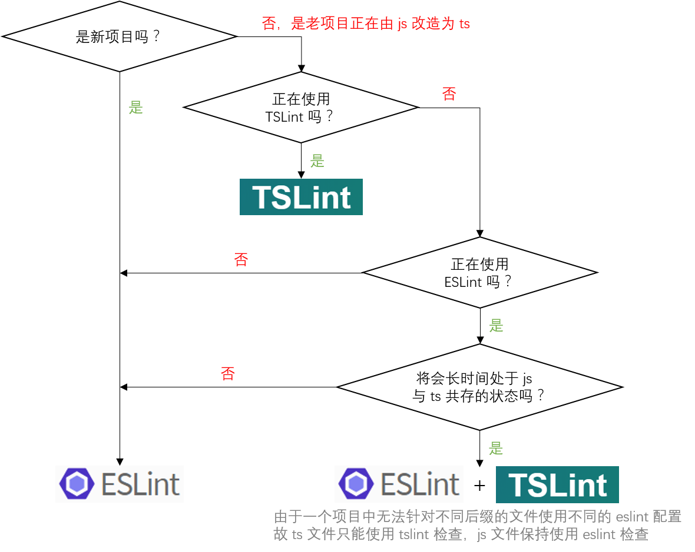

# 代码检查

目前 TypeScript 的代码检查主要有两个方案：使用 [TSLint][] 或使用 [ESLint][] + [`typescript-eslint-parser`][]。

## 什么是代码检查

代码检查主要是用来发现代码错误、统一代码风格。

在 JavaScript 项目中，我们一般使用 [ESLint][] 来进行代码检查。它通过插件化的特性极大的丰富了适用范围，搭配 [`typescript-eslint-parser`][] 之后，甚至可以用来检查 TypeScript 代码。

[TSLint][] 与 [ESLint][] 类似，不过除了能检查常规的 js 代码风格之外，TSLint 还能够通过 TypeScript 的语法解析，利用类型系统做一些 ESLint 做不到的检查。

## 为什么需要代码检查

有人会觉得，JavaScript 非常灵活，所以需要代码检查。而 TypeScript 已经能够在编译阶段检查出很多问题了，为什么还需要代码检查呢？

因为 TypeScript 关注的重心是类型的匹配，而不是代码风格。当团队的人员越来越多时，同样的逻辑不同的人写出来可能会有很大的区别：

- 缩进应该是四个空格还是两个空格？
- 是否应该禁用 `var`？
- 接口名是否应该以 `I` 开头？
- 是否应该强制使用 `===` 而不是 `==`？

这些问题 TypeScript 不会关注，但是却影响到多人协作开发时的效率、代码的可理解性以及可维护性。

下面来看一个具体的例子：

```ts
let myName = 'Tom';

console.log(`My name is ${myNane}`);
console.log(`My name is ${myName.toStrng()}`);
console.log(`My name is ${myName}`)

// tsc 报错信息：
//
// index.ts(3,27): error TS2552: Cannot find name 'myNane'. Did you mean 'myName'?
// index.ts(4,34): error TS2551: Property 'toStrng' does not exist on type 'string'. Did you mean 'toString'?
//
//
//
// eslint 报错信息：
//
// /path/to/index.ts
//   3:27  error  'myNane' is not defined         no-undef
//   5:38  error  Missing semicolon               semi
//
// ✖ 2 problems (2 errors, 0 warnings)
//   1 errors, 0 warnings potentially fixable with the `--fix` option.
//
//
//
// tslint 报错信息：
//
// ERROR: /path/to/index.ts[5, 36]: Missing semicolon
```

| 存在的问题 | `tsc` 是否报错 | `eslint` 是否报错 | `tslint` 是否报错 |
| --------- | ------------- | ---------------- | ----------------- |
| `myName` 被误写成了 `myNane` | ✅ | ✅ | ❌ |
| `toString` 被误写成了 `toStrng` | ✅️ | ❌ | ❌ |
| 少了一个分号 | ❌ | ✅ | ✅ |

上例中，由于 `eslint` 和 `tslint` 均无法识别 `myName` 存在哪些方法，所以对于拼写错误的 `toString` 没有检查出来。

而代码风格的错误不影响编译，故少了一个分号的错误 `tsc` 没有检查出来。

对于未定义的变量 `myNane`，`tsc` 可以检测出来。由于用到 `tslint` 的地方肯定会接入 `tsc` 编译，所以 `tslint` 就没必要检测这个错误了。`eslint` 需要能够独立于某个编译环境运行，所以能检测出此类错误，而对于 TypeScript 代码，这其实是一种冗余的检测了。

事实上，不止 `tsc` 与 `eslint` 之间有冗余的检测，`tsc` 与 `tslint` 之间也有一些冗余的检测，但是大部分都是因为早期的 `tsc` 还没能做到检测此类错误。

举个例子，TSLint 中的 `typeof-compare` 要求 `typeof` 表达式比较的对象必须是 `'undefined'`, `'object'`, `'boolean'`, `'number'`, `'string'`, `'function'` 或 `'symbol'` 之一。而 TypeScript 2.2 之后，编译器就已经自带了这个功能。

下图表示了 `tsc`, `eslint` 和 `tslint` 能覆盖的检查：


上图中，`tsc`, `eslint` 和 `tslint` 之间互相都有重叠的部分，也有各自独立的部分。

虽然发现代码错误比统一的代码风格更重要，但是当一个项目越来越庞大，开发人员也越来越多的时候，代码风格的约束还是必不可少的。

## 应该使用哪种代码检查工具

TSLint 与 ESLint 作为检查 TypeScript 代码的工具，各自有各自的优点：

TSLint 的优点：

1. 专为 TypeScript 服务，bug 比 ESLint 少
2. 不受限于 ESLint 使用的语法树 [ESTree](https://github.com/estree/estree)
3. 能直接通过 `tsconfig.json` 中的配置编译整个项目，使得在一个文件中的类型定义能够联动到其他文件中的代码检查

ESLint 的优点：

1. 基础规则比 TSLint 多很多（249 : 151）
2. 社区繁荣，插件众多（[50+](https://github.com/dustinspecker/awesome-eslint#plugins) : 9）

下面来看一些具体的例子：

```ts
let foo: string = 1 + '1';

// tslint 报错信息：
//
// ERROR: /path/to/index.ts[1, 19]: Operands of '+' operation must either be both strings or both numbers, consider using template literals
```

以上代码在 TSLint 中会报错，原因是加号两边必须同为数字或同为字符串（需要开启 `restrict-plus-operands` 规则）。

ESLint 无法知道加号两边的类型，所以对这种规则无能为力。

```ts
function foo(a, b, c, d, e, f, g, h) {
    doSomething();
}

// eslint 报错信息：
//
// /path/to/index.ts
//   1:1  error  Function 'foo' has too many parameters (8). Maximum allowed is 7  max-params
//
// ✖ 1 problem (1 error, 0 warnings)
```

ESLint 可以检测出来以上代码的函数参数超过了 7 个（需要开启 `max-params` 规则）。

但是 TSLint 没有此项检查，虽然也可以实现，但是需要自己手动写一条规则。

那么到底该使用哪种代码检测工具呢？经过一些实践，我建议可以按照以下流程决定：



## 在 TypeScript 中使用 ESLint

### 安装 ESLint

ESLint 可以安装在当前项目中或全局环境下，因为代码检查是项目的重要组成部分，所以我们一般会将它安装在当前项目中。可以运行下面的脚本来安装：

```bash
npm install eslint --save-dev
```

由于 ESLint 默认使用 [Espree](https://github.com/eslint/espree) 进行语法解析，无法识别 TypeScript 的一些语法，故我们需要安装 `typescript-eslint-parser`，替代掉默认的解析器，别忘了同时安装 `typescript`：

```bash
npm install typescript typescript-eslint-parser --save-dev
```

由于 `typescript-eslint-parser` 对一部分 ESLint 规则支持性不好，故我们需要安装 `eslint-plugin-typescript`，弥补一些支持性不好的规则。

```bash
npm install eslint-plugin-typescript --save-dev
```

### 创建配置文件

ESLint 需要一个配置文件来决定对哪些规则进行检查，配置文件的名称一般是 `.eslintrc.js` 或 `.eslintrc.json`。

当运行 ESLint 的时候检查一个文件的时候，它会首先尝试读取该文件的目录下的配置文件，然后再一级一级往上查找，将所找到的配置合并起来，作为当前被检查文件的配置。

我们在项目的根目录下创建一个 `.eslintrc.js`，内容如下：

```js
module.exports = {
    parser: 'typescript-eslint-parser',
    plugins: [
        'typescript'
    ],
    rules: {
        // @fixable 必须使用 === 或 !==，禁止使用 == 或 !=，与 null 比较时除外
        'eqeqeq': [
            'error',
            'always',
            {
                null: 'ignore'
            }
        ],
        // 类和接口的命名必须遵守帕斯卡命名法，比如 PersianCat
        'typescript/class-name-casing': 'error'
    }
}
```

以上配置中，我们指定了两个规则，其中 `eqeqeq` 是 ESLint 原生的规则（它要求必须使用 `===` 或 `!==`，禁止使用 `==` 或 `!=`，与 `null` 比较时除外），`typescript/class-name-casing` 是 `eslint-plugin-typescript` 为 ESLint 增加的规则（它要求类和接口的命名必须遵守帕斯卡命名法，比如 `PersianCat`）。

规则的取值一般是一个数组（上例中的 `eqeqeq`），其中第一项是 `off`、`warn` 或 `error` 中的一个，表示关闭、警告和报错。后面的项都是该规则的其他配置。

如果没有其他配置的话，则可以将规则的取值简写为数组中的第一项（上例中的 `typescript/class-name-casing`）。

关闭、警告和报错的含义如下：

- 关闭：禁用此规则
- 警告：代码检查时输出错误信息，但是不会影响到 exit code
- 报错：发现错误时，不仅会输出错误信息，而且 exit code 将被设为 1（一般 exit code 不为 0 则表示执行出现错误）

### 检查一个 ts 文件

创建了配置文件之后，我们来创建一个 ts 文件看看是否能用 ESLint 去检查它了。

创建一个新文件 `index.ts`，将以下内容复制进去：

```ts
interface person {
    name: string;
    age: number;
}

let tom: person = {
    name: 'Tom',
    age: 25
};

if (tom.age == 25) {
    console.log(tom.name + 'is 25 years old.');
}
```

然后执行以下命令：

```bash
./node_modules/.bin/eslint index.ts
```

则会得到如下报错信息：

```bash
/path/to/index.ts
   1:11  error  Interface 'person' must be PascalCased  typescript/class-name-casing
  11:13  error  Expected '===' and instead saw '=='     eqeqeq

✖ 2 problems (2 errors, 0 warnings)
```

上面的结果显示，刚刚配置的两个规则都生效了：接口 `person` 必须写成帕斯卡命名规范，`==` 必须写成 `===`。

需要注意的是，我们使用的是 `./node_modules/.bin/eslint`，而不是全局的 `eslint` 脚本，这是因为代码检查是项目的重要组成部分，所以我们一般会将它安装在当前项目中。

可是每次执行这么长一段脚本颇有不便，我们可以通过在 `package.json` 中添加一个 `script` 来创建一个 npm script 来简化这个步骤：

```json
{
    "scripts": {
        "eslint": "eslint index.ts"
    }
}
```

这时只需执行 `npm run eslint` 即可。

### 检查整个项目的 ts 文件

我们的项目源文件一般是放在 `src` 目录下，所以需要将 `package.json` 中的 `eslint` 脚本改为对一个目录进行检查。由于 `eslint` 默认不会检查 `.ts` 后缀的文件，所以需要加上参数 `--ext .ts`：

```json
{
    "scripts": {
        "eslint": "eslint src --ext .ts"
    }
}
```

此时执行 `npm run eslint` 即会检查 `src` 目录下的所有 `.ts` 后缀的文件。

### 在 VSCode 中集成 ESLint 检查

在编辑器中集成 ESLint 检查，可以在开发过程中就发现错误，极大的增加了开发效率。

要在 VSCode 中集成 ESLint 检查，我们需要先安装 ESLint 插件，点击「扩展」按钮，搜索 ESLint，然后安装即可。

VSCode 中的 ESLint 插件默认是不会检查 `.ts` 后缀的，需要在「文件 => 首选项 => 设置」中，添加以下配置：

```json
{
    "eslint.validate": [
        "javascript",
        "javascriptreact",
        "typescript"
    ]
}
```

这时再打开一个 `.ts` 文件，将鼠标移到红色提示处，即可看到这样的报错信息了：


### 使用 AlloyTeam 的 ESLint 配置

ESLint 原生的规则和 `eslint-plugin-typescript` 的规则太多了，而且原生的规则有一些在 TypeScript 中支持的不好，需要禁用掉。

这里我推荐使用 [AlloyTeam ESLint 规则中的 TypeScript 版本](https://github.com/AlloyTeam/eslint-config-alloy#typescript)，它已经为我们提供了一套完善的配置规则。

安装：

```bash
npm install --save-dev eslint typescript typescript-eslint-parser eslint-plugin-typescript eslint-config-alloy
```

在你的项目根目录下创建 `.eslintrc.js`，并将以下内容复制到文件中：

```js
module.exports = {
    extends: [
        'eslint-config-alloy/typescript',
    ],
    globals: {
        // 这里填入你的项目需要的全局变量
        // 这里值为 false 表示这个全局变量不允许被重新赋值，比如：
        //
        // jQuery: false,
        // $: false
    },
    rules: {
        // 这里填入你的项目需要的个性化配置，比如：
        //
        // // @fixable 一个缩进必须用两个空格替代
        // 'indent': [
        //     'error',
        //     2,
        //     {
        //         SwitchCase: 1,
        //         flatTernaryExpressions: true
        //     }
        // ]
    }
};
```

### 使用 ESLint 检查 tsx 文件

如果需要同时支持对 tsx 文件的检查，则需要对以上步骤做一些调整：

#### 安装 `eslint-plugin-react`

```bash
npm install --save-dev eslint-plugin-react
```

#### package.json 中的 scripts.eslint 添加 `.tsx` 后缀

```json
{
    "scripts": {
        "eslint": "eslint src --ext .ts,.tsx"
    }
}
```

#### VSCode 的配置中新增 typescriptreact 检查

```json
{
    "eslint.validate": [
        "javascript",
        "javascriptreact",
        "typescript",
        "typescriptreact"
    ]
}
```

#### 使用 AlloyTeam ESLint 规则中的 TypeScript React 版本

[AlloyTeam ESLint 规则中的 TypeScript React 版本](https://github.com/AlloyTeam/eslint-config-alloy#typescript-react)

## 在 TypeScript 中使用 TSLint

TSLint 的使用比较简单，参考[官网的步骤](https://palantir.github.io/tslint/)安装到本地即可：

```bash
npm install --save-dev tslint
```

创建配置文件 `tslint.json`

```json
{
    "rules": {
        // 必须使用 === 或 !==，禁止使用 == 或 !=，与 null 比较时除外
        "triple-equals": [
            true,
            "allow-null-check"
        ]
    },
    "linterOptions": {
        "exclude": [
            "**/node_modules/**"
        ]
    }
}
```

为 `package.json` 添加 `tslint` 脚本

```json
{
    "scripts": {
        "tslint": "tslint --project . src/**/*.ts src/**/*.tsx",
    }
}
```

其中 `--project .` 会要求 `tslint` 使用当前目录的 `tsconfig.json` 配置来获取类型信息，很多规则需要类型信息才能生效。

此时执行 `npm run tslint` 即可检查整个项目。

### 在 VSCode 中集成 TSLint 检查

在 VSCode 中安装 `tslint` 插件即可，安装好之后，默认是开启的状态。

### 使用 AlloyTeam 的 TSLint 配置

AlloyTeam 为 TSLint 也打造了一套配置 [tslint-config-alloy](https://github.com/AlloyTeam/tslint-config-alloy)

```bash
npm install --save-dev tslint-config-alloy
```

安装之后修改 `tslint.json` 即可

```json
{
    "extends": "tslint-config-alloy",
    "rules": {
        // 这里填入你的项目需要的个性化配置，比如：
        //
        // 一个缩进必须用两个空格替代
        // "indent": [
        //     true,
        //     "spaces",
        //     2
        // ]
    },
    "linterOptions": {
        "exclude": [
            "**/node_modules/**"
        ]
    }
}
```

### 使用 TSLint 检查 tsx 文件

TSLint 默认支持对 tsx 文件的检查，不需要做额外配置。

## Troubleshootings

### Cannot find module 'typescript-eslint-parser'

你运行的是全局的 eslint，需要改为运行 `./node_modules/.bin/eslint`。

### cannot read property type of null

需要关闭 `eslint-plugin-react` 中的规则 `react/jsx-indent`。

如果仍然报错，多半是因为某些规则需要被关闭，可以使用「二分排错法」检查是哪个规则造成了错误。也欢迎[给 eslint-config-alloy 提 issue](https://github.com/AlloyTeam/eslint-config-alloy/issues/new)。

### VSCode 没有显示出 ESLint 的报错

1. 检查「文件 => 首选项 => 设置」中有没有配置正确
2. 检查必要的 npm 包有没有安装
3. 检查 `.eslintrc.js` 有没有配置
4. 检查文件是不是在 `.eslintignore` 中

如果以上步骤都不奏效，则可以在「文件 => 首选项 => 设置」中配置 `"eslint.trace.server": "messages"`，按 `Ctrl`+`Shift`+`U` 打开输出面板，然后选择 ESLint 输出，查看具体错误。


### 为什么 ESLint 无法检查出使用了未定义的变量（`no-undef` 规则为什么被关闭了）？

因为 `typescript-eslint-parser` [无法支持 `no-undef` 规则](https://github.com/eslint/typescript-eslint-parser/issues/416)。它针对正确的接口定义会报错。

所以我们一般会关闭 `no-undef` 规则。

### 为什么有些定义了的变量（比如使用 `enum` 定义的变量）未使用，ESLint 却没有报错？

因为无法支持这种变量定义的检查。建议在 `tsconfig.json` 中添加以下配置，使 `tsc` 编译过程能够检查出定义了未使用的变量：

```json
{
    "compilerOptions": {
        "noUnusedLocals": true,
        "noUnusedParameters": true
    }
}
```

### 启用了 noUnusedParameters 之后，只使用了第二个参数，但是又必须传入第一个参数，这就会报错了

第一个参数以下划线开头即可，参考 https://github.com/Microsoft/TypeScript/issues/9458

### 为什么有的错误 TSLint 可以检查出来，vscode 里的 TSLint 却检查不出来？

因为 TSLint 依赖 `tsconfig.json` 获得了类型信息，而 [vscode 里的 TSLint 暂不支持获取类型信息](https://github.com/Microsoft/vscode-tslint/tree/master/tslint#the-tslint-no-unused-variable-rule-doesnt-report-warnings-any-more)，所以 `no-unused-variable` 就失效了。

不仅 `no-unused-variables` 失效了，[TSLint rules](https://palantir.github.io/tslint/rules/) 里面所有标有 `Requires Type Info` 的规则都失效了。

[TSLint]: https://palantir.github.io/tslint/
[ESLint]: https://eslint.org/
[`typescript-eslint-parser`]: https://github.com/eslint/typescript-eslint-parser

---

- [上一章：工程](README.md)
- [下一章：感谢](../thanks/README.md)
